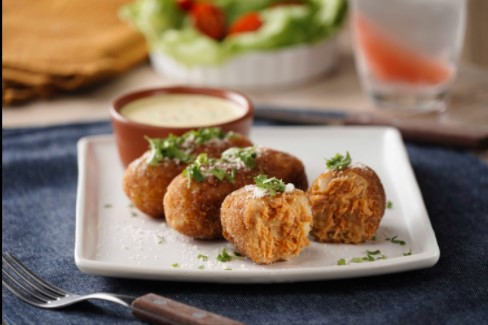

  
# 
"**CROQUETAS DE PAPA CON ATUN AL CHIPOTLE**" 

## 
 " *INSTRUCCIONES* " 

--------------------------------------------------------------------------  
| Cantidad| Ingrediente                                                   |
| --------| --------------------------------------------------------------|
|  4      | papas, grandes, sin cáscara, en mitades y cocidas :potato:    |
|  3      | cucharadas de mantequilla, en cubos, suave, para las croquetas|
|  1/4    | tazas de crema para batir, para las croquetas  :butter:       |
|  1/2    | tazas de cebolla, finamente picada, para las croquetas :onion:|
|  1      | cucharadita de ajo en polvo, para las croquetas               |
| 1/4     | tazas de pan molido, o pan, para las croquetas                |
| 1/4     | tazas de fécula de maíz, para las croquetas                   |
| 3       |sobres de Atún con 29% de Aderezo de Mayonesa Chipotle Herdez , 85 g c/ sobre|
| 1       | huevo, para las croquetas :egg:                               |
| al gusto| sal, para las croquetas :salt:                                |
| al gusto| pimienta, para las croquetas :salt:                           |
| 2       | tazas de harina, para empanizar                               |
| 2 | huevos, para empanizar :egg: |
| 2 | tazas de pan molido, o pan para empanizar |
| X | suficiente de aceite vegetal, para freír |
| 1 | taza de mayonesa, para el aderezo |
| 2 | cucharadas de mostaza, para el aderezo |
| 1/4 | tazas de salmuera de pepinillos , picados, para el aderezo | 
| 1/4 | tazas de cebolla morada, finamente picada, para el aderezo |
| 2 | cucharadas de jugo de limón, para el aderezo :lemon: |
| X | suficiente de pimienta, para el aderezo :salt: |
| X | suficiente de parmesano, rallado, para decorar|

## 
 " *Preparación* " 

- Coloca las papas en un bowl y con ayuda de un aplastador de papas, presiona las papas hasta que se hagan puré. Entonces agrega la mantequilla, la crema para batir, la cebolla, el ajo en polvo, el pan molido, la fécula de maíz, el Atún con 29% de Aderezo de Mayonesa Chipotle Herdez® y el huevo, sazona con sal y pimienta, e integra hasta obtener una masa manipulable.

- Toma un poco de la masa (aproximadamente 40 gramos) y con ayuda de tus manos forma pequeñas bolitas, luego presiónalas y alárgalas poco a poco, de esta manera le darás una forma de croqueta. Repite hasta terminar con la mezcla. Refrigera por 20 minutos.

- Pasa las croquetas sobre la harina, luego baña con huevo y cubre con pan molido o panko. En un sartén con aceite vegetal caliente, fríe las croquetas por ambos lados por 6 minutos a fuego medio bajo. Escurre.

- Para el aderezo, mezcla la mayonesa con la mostaza, los pepinillos, la salmuera, la cebolla morada, el jugo de limón y la pimienta hasta integrar.

- Sirve las croquetas con el aderezo. Decora con perejil y queso parmesano rallado.

--------------------------------------------------------------------------

## 
 " *Consulta el Video* " 

